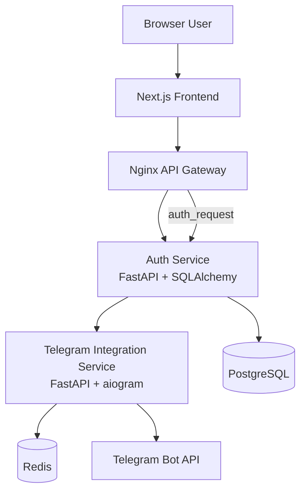

# CRM Workroom

> A modular CRM workspace platform for team operations, onboarding, internal communication, project execution, scheduling, and knowledge sharing.

[](https://nextjs.org/)
[](https://www.typescriptlang.org/)
[](https://fastapi.tiangolo.com/)
[](https://tailwindcss.com/)
[](https://www.docker.com/)

## Table of Contents

- [Overview](#overview)
- [Current Repository Status](#current-repository-status)
- [Product Scope](#product-scope)
- [Architecture](#architecture)
- [Services](#services)
- [Frontend Application](#frontend-application)
- [Authentication and Onboarding](#authentication-and-onboarding)
- [Planned Product Modules](#planned-product-modules)
- [Database and State Model](#database-and-state-model)
- [API Surface](#api-surface)
- [Project Structure](#project-structure)
- [Getting Started](#getting-started)
- [Environment Variables](#environment-variables)
- [Development Workflow](#development-workflow)
- [Deployment Notes](#deployment-notes)
- [Implementation Notes and Gaps](#implementation-notes-and-gaps)

## Overview

CRM Workroom is a microservice-oriented internal workspace platform designed around a broad CRM and team-operations product surface. The repository already contains a working authentication stack, Telegram-based phone verification, a protected dashboard shell, and the initial Next.js frontend structure. It also captures the broader intended product surface across the remaining CRM domains.

The project combines three sources of truth:

- running code in `web/`, `services/auth-service/`, `services/telegram-integration-service/`, and `services/api-gateway/`

This README documents both the current implementation and the intended product scope, clearly separating what is already shipped in this repository from what is planned for future implementation.

## Current Repository Status

### Implemented in code

- Next.js frontend shell with:
  - sign-in page
  - 4-step signup flow
  - signup success page
  - protected dashboard layout
  - dashboard overview widgets
  - nearest events page
- FastAPI Auth Service with:
  - email/password login
  - workspace registration
  - Telegram verification initialization and check flow
  - access token and refresh token cookie sessions
  - session refresh, logout, and session lookup
  - JWT validation endpoint for gateway auth checks
- Telegram Integration Service with:
  - verification intent creation
  - Redis-backed verification session storage
  - Telegram webhook or polling runtime
  - contact-share validation flow and verification code checking
- Nginx API Gateway with:
  - reverse proxying
  - auth validation hook for protected routes
  - rate limiting
- Docker Compose setup for local development and production-like local orchestration

### Defined but not yet implemented as full modules

- Projects and task management
- Calendar and event management
- Vacations and time-off management
- Employees directory and activity view
- Profile and settings area
- Messenger
- Info Portal
- Support flows
- Add project and add event forms

## Product Scope

CRM Workroom is designed as a unified workspace for internal company operations. The intended platform includes the following domains.

### 1. Workspace onboarding and identity

- sign-in with email and password
- multi-step workspace registration
- Telegram-based phone verification instead of SMS
- JWT-backed authenticated sessions using httpOnly cookies
- invitation-based team onboarding

### 2. Dashboard and operational overview

- personalized greeting and global workspace shell
- workload summary
- nearest events
- recent projects
- activity stream

### 3. Projects and task management

- project selector and project details
- task board, list, grouped list, and timeline views
- task details with attachments and activity history
- time tracking and time log submission
- filter drawer and deep project/task detail states

### 4. Calendar and event planning

- monthly work-week calendar
- event chips with type and trend indicators
- add-event flows and repeat rules

### 5. Employees and profile management

- employee list and activity workload view
- add employee modal
- user profile views for projects, team, vacations, and settings
- notification preferences and personal details editing

### 6. Vacations and availability

- global vacation balance summary
- company-wide vacation timeline calendar
- personal request creation with validation against available balance

### 7. Messenger

- real-time direct and group conversations
- message history and unread states
- typing indicators
- mentions, links, attachments, and detail panels

### 8. Info Portal

- folder-based knowledge repository
- page list and rich content view
- attachments and sharing workflows

## Architecture

### High-level architecture



### Architectural principles

- Microservice-oriented backend boundary design.
- API Gateway as the single public backend entry point.
- Auth Service as the source of truth for users, workspaces, invitations, and sessions.
- Telegram Integration Service isolated from Auth so Telegram-specific runtime concerns stay outside the core identity domain.
- Frontend structured by business modules rather than by technical layer alone.
- The repository mixes implemented services with forward-looking product specs for upcoming domains.

### Communication model

- Browser to backend: HTTP requests through the API Gateway.
- Frontend auth requests: proxied to Auth Service via `/api/v1/auth/*`.
- Gateway auth checks: internal `auth_request` to `/api/v1/auth/validate-token`.
- Auth to Telegram service: internal HTTP contract for verification intent creation and code validation.
- Telegram service to Redis: ephemeral verification state with TTL.
- Telegram service to Telegram Bot API: webhook or long-polling delivery.

## Services

### `web/`

The frontend is a Next.js App Router application that currently implements authentication, onboarding, session guards, dashboard layout, and dashboard feature views.

Key technologies:

- Next.js 16
- React 19
- TypeScript 5
- Tailwind CSS 4
- shadcn/ui-style local components
- TanStack Query
- React Hook Form
- Zod
- Zustand
- Axios

### `services/api-gateway/`

Nginx-based gateway that exposes the backend on port `8000`.

Responsibilities:

- reverse proxy for auth routes
- rate limiting
- authentication validation for non-auth API routes
- future gateway entry point for additional microservices

Current behavior for non-auth routes:

- the gateway authenticates them first
- then returns `501 Microservice Not Implemented Yet`

This is an explicit indicator that the gateway is already shaped for future service expansion.

### `services/auth-service/`

FastAPI microservice responsible for authentication and workspace onboarding.

Responsibilities:

- login via email and password
- workspace registration
- cookie-based access and refresh sessions
- refresh rotation and logout
- current-session lookup
- JWT validation for the gateway
- onboarding orchestration with Telegram verification

Implementation details:

- FastAPI app with CORS configured for the frontend origin
- SQLAlchemy models created on startup
- SQLite default for simple local runs
- PostgreSQL in Docker Compose
- PyJWT for access tokens
- refresh sessions persisted in the database

### `services/telegram-integration-service/`

Dedicated microservice for Telegram verification flows.

Responsibilities:

- create short-lived verification intents
- generate bot deep links
- store verification state in Redis
- process Telegram updates
- validate shared Telegram contact against the requested phone number
- expose code-checking endpoint to Auth Service

Implementation details:

- FastAPI runtime
- aiogram 3 dispatcher
- Redis async storage
- supports both webhook mode and polling mode
- five-minute verification TTL by default

## Frontend Application

### Current route map

- `/` redirects to `/login`
- `/login` renders the sign-in experience
- `/signup` redirects to `/signup/step-1`
- `/signup/[step]` renders the step-based onboarding flow
- `/signup/success` renders registration success
- `/dashboard` renders the dashboard overview
- `/dashboard/nearest-events` renders the extended events view

### Frontend architecture

The frontend follows a modular structure around business domains:

- `src/app/` for routing and layout composition
- `src/modules/auth/` for sign-in, onboarding, API hooks, store, and step forms
- `src/modules/dashboard/` for dashboard widgets, views, and event types
- `src/components/ui/` for local reusable UI primitives
- `src/components/layout/` for sidebar and topbar
- `src/config/` for shared navigation config

### Layout model

- unauthenticated screens use a dedicated auth layout
- authenticated screens use a persistent sidebar plus topbar shell
- session gating is handled in the frontend via auth queries and guards

### Navigation model

The sidebar already advertises the broader CRM information architecture:

- Dashboard
- Projects
- Calendar
- Vacations
- Employees
- Messanger
- Info Portal

Note: the current code spells Messenger as `Messanger` in the navigation config and points to `/messanger`. This is a current implementation detail, not the intended product spelling.

## Authentication and Onboarding

The auth flow is the most complete vertical slice currently present in the repository.

### Sign-in flow

1. User opens `/login`.
2. Frontend submits credentials to `POST /api/v1/auth/login`.
3. Auth Service validates credentials and creates refresh session state.
4. Response sets `access_token` and `refresh_token` cookies.
5. Frontend redirects to `/dashboard`.

### Signup flow

The signup flow is implemented as a linear four-step wizard.

1. Step 1: phone number, Telegram verification code, email, password.
2. Step 2: usage purpose, role description, additional boolean question.
3. Step 3: company name, business direction, team size.
4. Step 4: invited member emails.

The frontend stores draft onboarding data in a Zustand store and only allows forward progression to valid next steps.

### Telegram verification flow

1. Frontend calls `POST /api/v1/auth/init-telegram-verification` with a phone number.
2. Auth Service calls Telegram Integration Service to create a verification intent.
3. Telegram Integration Service returns a bot deep link and expiry.
4. User opens the bot and shares their Telegram contact.
5. Telegram service validates contact ownership and phone match.
6. Telegram service generates a 6-digit code and stores it in Redis.
7. Frontend submits code to `POST /api/v1/auth/verify-telegram-code`.
8. Final registration is submitted to `POST /api/v1/auth/register-workspace`.

### Session model

- access token stored in httpOnly cookie
- refresh token stored in httpOnly cookie
- frontend Axios client retries once after `401` by calling `/api/v1/auth/refresh`
- logout clears both cookies and revokes the refresh session
- gateway validation uses cookie-based auth, not bearer tokens from the frontend

## Planned Product Modules

The following product areas are part of the broader intended platform scope.

### Dashboard

- dashboard summary widgets
- expanded nearest events view
- support modal/state

### Projects

- project list
- board view
- drag-and-drop board interactions
- timeline view and hover states
- filter panel
- project details
- task details and status changes
- time tracking modal
- add-project flow

### Calendar

- month navigation
- work-week grid
- event overflow handling
- add-event and recurring-event variants

### Employees

- list view
- activity view
- invite/add employee modal
- employee profile variants for managers

### Profile

- current projects tab
- team tab
- my vacations tab
- add-request states for vacations
- settings panel
- notifications dropdown

### Vacations

- employee vacation balances
- timeline calendar by employee
- request indicators by leave type and status

### Messenger

- base conversation view
- link handling
- mentions
- attached files
- search in chat
- details, members, and files panes
- typing indicator
- message editing and hover states

### Info Portal

- top-level folder grid
- nested folder page view
- share modal/state

## Database and State Model

### Currently implemented relational models

The Auth Service currently defines these persisted entities:

- `workspaces`
  - company name
  - business direction
  - usage purpose
  - team size
  - `has_team`
  - created timestamp
- `users`
  - workspace relation
  - email
  - password hash
  - phone number
  - role description
  - verification state
  - last login
- `invitations`
  - workspace relation
  - invited email
  - inviter user ID
  - status
- `refresh_sessions`
  - user relation
  - hashed token
  - expiry
  - revocation state
  - user agent and IP metadata
  - rotation counter

### Currently implemented ephemeral state

The Telegram Integration Service stores short-lived verification state in Redis, including:

- intent payload by short token
- reverse lookup by phone number
- temporary Telegram user binding

### Full target data model

The broader target schema extends beyond the currently implemented auth database and proposes storage for:

- employee profiles
- notification settings
- projects
- tasks
- time entries
- vacation balances
- time-off requests
- info portal folders and pages
- messenger conversations and messages
- Redis-backed transient presence and invitation state

## API Surface

### Auth Service endpoints

Public through the gateway:

- `POST /api/v1/auth/login`
- `POST /api/v1/auth/init-telegram-verification`
- `POST /api/v1/auth/verify-telegram-code`
- `POST /api/v1/auth/register-workspace`
- `POST /api/v1/auth/refresh`
- `POST /api/v1/auth/logout`
- `GET /api/v1/auth/me`

Internal or gateway-facing:

- `GET /api/v1/auth/validate-token`
- `GET /health`

### Telegram Integration Service endpoints

- `GET /health`
- `POST /internal/verifications/intents`
- `POST /internal/verifications/check`
- `POST /webhooks/telegram/{secret}`

### Gateway behavior

- `/api/v1/auth/*` is proxied to Auth Service.
- `/api/v1/*` for future non-auth domains is reserved behind auth validation.
- those non-auth routes currently return `501` until their downstream microservices exist.

## Project Structure

```text
crm-workroom/
├── design/
│   ├── auth.pen
│   └── extract_pen.mjs
├── services/
│   ├── api-gateway/
│   ├── auth-service/
│   └── telegram-integration-service/
├── web/
│   ├── src/app/
│   ├── src/components/
│   ├── src/config/
│   ├── src/lib/
│   └── src/modules/
├── docker-compose.yml
└── docker-compose.dev.yml
```

## Getting Started

### Prerequisites

- Docker and Docker Compose
- Node.js 20+ if running the frontend outside Docker
- Python 3.12+ if running Python services outside Docker
- Telegram bot credentials for verification flows

### Fastest way to run the stack

Production-like local stack:

```bash
docker compose up --build
```

Development stack with hot reload:

```bash
docker compose -f docker-compose.yml -f docker-compose.dev.yml up --build
```

### Local endpoints

- frontend: `http://localhost:3000`
- API gateway: `http://localhost:8000`
- auth service: `http://localhost:8080`
- telegram integration service: `http://localhost:8081`
- redis: `localhost:6379`

### Running services individually

#### Frontend

```bash
cd web
npm install
npm run dev
```

#### Auth Service

```bash
cd services/auth-service
pip install -e .
alembic upgrade head
uvicorn app.main:app --reload --port 8080
```
#### Telegram Integration Service

```bash
cd services/telegram-integration-service
pip install -e .
uvicorn app.main:app --reload --port 8081
```

## Environment Variables

### Frontend

| Variable | Required | Default | Purpose |
| --- | --- | --- | --- |
| `NEXT_PUBLIC_API_BASE_URL` | No | `http://localhost:8080` in code, `http://localhost:8000` in Docker | Base URL used by the frontend auth API client |

Note: the Docker setup points the frontend at the API gateway on port `8000`, while the frontend code falls back to `http://localhost:8080` if the variable is not provided.

### Auth Service

| Variable | Required | Default | Purpose |
| --- | --- | --- | --- |
| `APP_ENV` | No | `development` | Runtime mode |
| `DATABASE_URL` | Yes | none | Auth PostgreSQL connection, typically Neon |
| `FRONTEND_URL` | No | `http://localhost:3000` | CORS allow-origin |
| `TELEGRAM_SERVICE_URL` | No | `http://localhost:8000` | Base URL for Telegram verification service calls |
| `JWT_SECRET_KEY` | Yes for real usage | `change-me` | JWT signing secret |
| `ACCESS_TOKEN_TTL_SECONDS` | No | `900` | Access token TTL |
| `REFRESH_TOKEN_TTL_SECONDS` | No | `2592000` | Refresh token TTL |
| `COOKIE_SECURE` | No | `false` | Secure-cookie flag |
| `COOKIE_DOMAIN` | No | unset | Cookie domain override |

### Telegram Integration Service

| Variable | Required | Default | Purpose |
| --- | --- | --- | --- |
| `APP_ENV` | No | `development` | Runtime mode |
| `REDIS_URL` | No | `redis://localhost:6379/0` | Redis connection |
| `TELEGRAM_BOT_TOKEN` | Yes | none | Bot token |
| `TELEGRAM_BOT_USERNAME` | No | `workroom_verification_bot` | Bot username used in deep links |
| `TELEGRAM_DELIVERY_MODE` | No | `webhook` | `webhook` or `polling` |
| `TELEGRAM_WEBHOOK_SECRET` | Yes | none | Webhook secret path segment |
| `VERIFICATION_TTL_SECONDS` | No | `300` | Verification TTL |

## Development Workflow

### Typical local workflow

1. Start the full stack with the dev compose command.
2. Open the frontend at `http://localhost:3000`.
3. Use the sign-up flow to exercise Telegram verification and workspace creation.
4. Sign in and verify protected dashboard access.
5. Use gateway-authenticated requests as new services are added behind `/api/v1/*`.

### Frontend state conventions

- server state uses TanStack Query
- local auth onboarding draft uses Zustand
- form validation uses React Hook Form and Zod
- API transport uses Axios with credentials enabled

### Python service conventions

- FastAPI for service interfaces
- settings managed via `pydantic-settings`
- SQLAlchemy async engine for Auth Service persistence
- Redis async access for Telegram verification state

## Deployment Notes

The repository is currently optimized for Docker Compose-based local development. Production deployment will likely require the following hardening steps:

- replace development defaults such as `JWT_SECRET_KEY=change-me`
- provide real Telegram bot secrets through secure secret management
- move from SQLite to PostgreSQL where applicable
- configure TLS termination in front of the gateway
- restrict Telegram internal endpoints from public exposure
- add persistence, backup, and migration workflows for database services
- introduce proper observability, logging, and error tracking

## Implementation Notes and Gaps

### What is solid today

- auth and onboarding flow architecture is coherent end-to-end
- gateway, auth service, Telegram service, Redis, and Postgres are wired together in Compose
- frontend module boundaries are already set up for further domain expansion
- the repository already provides clear product direction for the next implementation phases

### What remains to be built

- the majority of CRM domain modules remain specification-driven rather than runtime-complete
- gateway routes for non-auth domains still return `501`
- dashboard data is currently mocked in the frontend
- there is no implemented Projects, Calendar, Employees, Vacations, Messenger, Info Portal, or Profile backend yet

### Recommended next implementation sequence

1. Complete a shared API contract strategy for the next services.
2. Implement Projects as the next backend/frontend vertical slice.
3. Add Employees and Profile data foundations.
4. Implement Calendar and Vacations on top of shared employee and event models.
5. Introduce Messenger and Info Portal once the core CRUD domains are stable.
